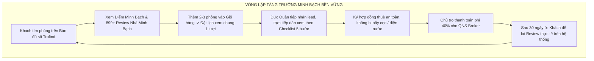
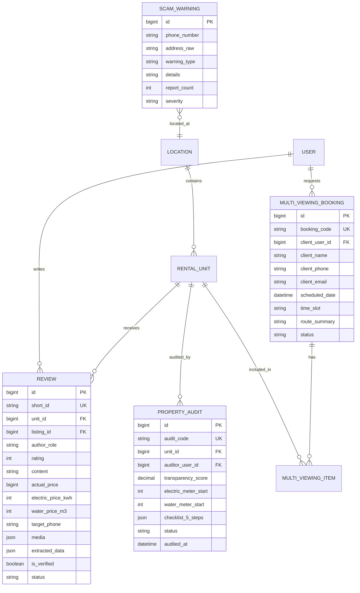
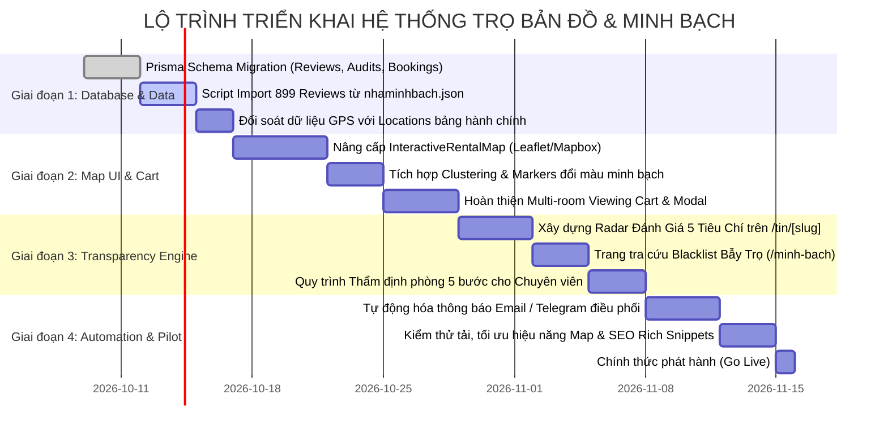

# HỆ THỐNG TRỌ BẢN ĐỒ & MINH BẠCH (SMART & TRANSPARENT RENTAL ECOSYSTEM)
## Kiến Trúc Quy Mô Lớn: Hợp Nhất Nền Tảng Bản Đồ Tìm Trọ (Trofind) & Hệ Thống Đánh Giá Minh Bạch (Nhà Minh Bạch) Vào Website Bất Động Sản D:\BĐS

> 📅 **Phiên bản:** 2.0 Enterprise Architecture  
> 🏢 **Dự án gốc:** `D:\BĐS` (Monorepo Turborepo + Next.js 14 App Router + NestJS + PostgreSQL / Prisma)  
> 🎯 **Mục tiêu:** Xây dựng quy mô lớn phân hệ **Thuê Phòng Trọ Thông Minh**, hợp nhất hoàn chỉnh trải nghiệm tìm kiếm bản đồ số + giỏ hàng xem phòng tập trung (từ tệp mẫu `trọ.zip` / Trofind) với toàn bộ dữ liệu & cơ chế thẩm định, chống lừa đảo từ `https://nhaminhbach.com/`. Hai hệ thống bổ trợ lẫn nhau, chạy song song và tạo thành vòng tuần hoàn tăng trưởng bền vững (Flywheel).

---

## MỤC LỤC CHI TIẾT

1. [TỔNG QUAN CHIẾN LƯỢC VÀ BỐI CẢNH DỰ ÁN](#1-tổng-quan-chiến-lược-và-bối-cảnh-dự-án)
   - 1.1 Hiện trạng hệ thống website tổng `D:\BĐS`
   - 1.2 Phân tích chi tiết tệp minh họa `trọ.zip` (Mô hình Trofind)
   - 1.3 Phân tích toàn diện website tham chiếu `https://nhaminhbach.com/`
   - 1.4 Lý do và giá trị cốt lõi của việc hợp nhất 2 mô hình
2. [KIẾN TRÚC THÔNG TIN & TRẢI NGHIỆM NGƯỜI DÙNG HỢP NHẤT (UI/UX)](#2-kiến-trúc-thông-tin--trải-nghiệm-người-dùng-hợp-nhất-uiux)
   - 2.1 Bản đồ tương tác Map-First kết hợp Lớp dữ liệu Minh Bạch (Transparency Overlay)
   - 2.2 Hệ thống phân loại & Marker động (Clustering, Transparency Badges)
   - 2.3 Thẻ xem nhanh (Map Room Card) tích hợp Chỉ số Minh Bạch
   - 2.4 Cơ chế "Giỏ hàng chọn nhiều phòng" để đặt lịch xem phòng tập trung (Multi-room Viewing Cart)
   - 2.5 Trang chi tiết phòng (`/tin/[slug]`) với Hồ sơ Minh Bạch & Radar Đánh Giá 5 Tiêu Chí
   - 2.6 Phân hệ độc lập: Trung tâm Dữ liệu Minh Bạch & Tra cứu Bẫy Trọ (`/minh-bach`)
3. [THIẾT KẾ DỮ LIỆU & KIẾN TRÚC CƠ SỞ DỮ LIỆU (DATABASE SCHEMA)](#3-thiết-kế-dữ-liệu--kiến-trúc-cơ-sở-dữ-liệu-database-schema)
   - 3.1 Cấu trúc Prisma Schema mở rộng cho `packages/database`
   - 3.2 Bảng Đánh giá & Phản ánh cộng đồng (`Review`)
   - 3.3 Bảng Thẩm định thực tế & Biên bản 5 bước (`PropertyAudit`)
   - 3.4 Bảng Danh sách đen & Cảnh báo bẫy trọ (`ScamWarning` / `BlacklistPhone`)
   - 3.5 Bảng Giỏ xem phòng & Đặt lịch đa phòng (`MultiViewingBooking`)
   - 3.6 Kế hoạch nạp sẵn 899+ bản ghi reviews thực tế từ nhaminhbach.com
4. [KIẾN TRÚC BACKEND API & MICRO-MODULES (NESTJS - APPS/API)](#4-kiến-trúc-backend-api--micro-modules-nestjs---appsapi)
   - 4.1 `MapSearchModule`: API Clustering Geo-spatial & Lọc đa tiêu chí
   - 4.2 `ReviewsModule`: Tiếp nhận review, tính điểm uy tín, kiểm duyệt tự động
   - 4.3 `TransparencyModule`: API tra cứu độ uy tín SĐT/Địa chỉ, tiếp nhận yêu cầu thẩm định
   - 4.4 `ViewingCartModule`: Gom lịch, tối ưu lộ trình dẫn xem (Route Optimization), điều phối chuyên viên
   - 4.5 Worker xử lý ngầm (Outbox Event, gửi Email xác nhận, cảnh báo an toàn)
5. [KIẾN TRÚC FRONTEND & HIỆU NĂNG CAO (NEXT.JS 14 - APPS/WEB)](#5-kiến-trúc-frontend--hiệu-năng-cao-nextjs-14---appsweb)
   - 5.1 Kiến trúc Dual-View (Bản đồ số song song Danh sách phòng)
   - 5.2 Xử lý render hàng nghìn Markers mượt mà với Mapbox GL / Leaflet Vector Grid
   - 5.3 Global State & Persistent Store cho Giỏ phòng (`selected-rooms.ts`)
   - 5.4 Programmatic SEO cho 899+ ngõ ngách, trường đại học và khu trọ Hà Nội & TP.HCM
6. [QUY TRÌNH VẬN HÀNH THỰC TẾ & MÔ HÌNH KINH DOANH (O2O WORKFLOW)](#6-quy-trình-vận-hành-thực-tế--mô-hình-kinh-doanh-o2o-workflow)
   - 6.1 Luồng người tìm thuê: Khám phá -> So sánh minh bạch -> Đặt lịch 1 chạm
   - 6.2 Luồng điều phối dẫn xem trực tiếp (Đức Quân / QNS Broker)
   - 6.3 Quy trình kiểm tra hiện trường chuẩn 5 bước của Nhà Minh Bạch
   - 6.4 Cơ chế tạo doanh thu: Thu phí 40% từ chủ trọ, khách thuê miễn phí 100%
   - 6.5 Vòng lặp phản hồi (Feedback Flywheel) sau khi ký hợp đồng
7. [LỘ TRÌNH TRIỂN KHAI THEO GIAI ĐOẠN (SPRINT ROADMAP)](#7-lộ-trình-triển-khai-theo-giai-đoạn-sprint-roadmap)
   - Giai đoạn 1: Schema Migration & Import dữ liệu 899 reviews từ nhaminhbach
   - Giai đoạn 2: Nâng cấp Map-First UI & Giỏ hàng đặt lịch xem phòng
   - Giai đoạn 3: Tích hợp Radar Minh Bạch & Hệ thống cảnh báo bẫy trọ
   - Giai đoạn 4: Tự động hóa lộ trình dẫn xem & Hoàn thiện trang quản trị Admin
8. [CHECKLIST KIỂM ĐỊNH CHẤT LƯỢNG & AN TOÀN HỆ THỐNG](#8-checklist-kiểm-định-chất-lượng--an-toàn-hệ-thống)

---

## 1. TỔNG QUAN CHIẾN LƯỢC VÀ BỐI CẢNH DỰ ÁN

### 1.1 Hiện trạng hệ thống website tổng `D:\BĐS`
Hệ thống `D:\BĐS` được thiết kế theo mô hình Monorepo chuyên nghiệp sử dụng **Turborepo** và **pnpm workspace**, bao gồm:
- **`apps/web`**: Frontend xây dựng trên **Next.js 14 (App Router)**, TypeScript, Tailwind CSS, hỗ trợ Server Components (RSC) kết hợp Client Components, phục vụ SEO mạnh mẽ. Đã có các trang danh mục `/cho-thue-tro`, `/thue`, `/mua-ban`, `/gia-nha-dat`, `/du-an`, `/moi-gioi`, `/tin/[slug]`. Đã có nền tảng ban đầu về giỏ chọn phòng (`SelectedRoomsModal.tsx`, `selected-rooms.ts`).
- **`apps/api`**: Backend xây dựng trên **NestJS**, kiến trúc modular hướng miền (Domain-Driven Modules: `auth`, `listings`, `viewings`, `deals`, `commissions`, `payments`, `leads`, `locations`, `membership`, `universities`, `uploads`, `outbox`, `tasks`).
- **`packages/database`**: Lớp dữ liệu trung tâm sử dụng **Prisma ORM** kết nối **PostgreSQL**. Đã áp dụng các mẫu kiến trúc cấp doanh nghiệp như: *Transactional Outbox Pattern* (`outbox_events`), *Append-only Financial Ledger* (`finance_ledgers`), *Audit Logging* (`audit_events`).
- **Định hướng chiến lược V2 (25/09/2026)**:
  - Vận hành theo mô hình **Môi giới cho thuê chuyên biệt có người thật (Đức Quân / QNS BROKER)** làm đầu mối duy nhất tiếp nhận lead, tư vấn và trực tiếp dẫn xem phòng.
  - **Khách thuê miễn phí 100%**: Không cần đăng ký tài khoản rườm rà, không thu phí dịch vụ từ khách.
  - **Không thanh toán trực tuyến trên web**: Tuyệt đối không checkout ngân hàng tự động đối với người thuê nhằm bảo vệ khách trước các rủi ro gian lận mạng.
  - **Thu phí thành công 40%** từ chủ trọ khi hợp đồng thuê ký thành công và phòng được bàn giao.
  - Bảo vệ tuyệt đối số điện thoại và danh tính riêng của chủ trọ; toàn bộ hiển thị công khai qua đầu mối của Quân.

---

### 1.2 Phân tích chi tiết tệp minh họa `trọ.zip` (Mô hình Trofind)
Tệp `trọ.zip` cung cấp 3 hình ảnh chụp màn hình (`trọ 1.jpg`, `trọ 2.jpg`, `trọ 4.jpg`) và 1 video quay màn hình thao tác thực tế (`trọ 3.mp4` dài 46.5 giây) từ ứng dụng **TROFIND** (`trofind.com`). Qua phân tích frame-by-frame, mô hình Trofind sở hữu các điểm sáng vượt trội:

```
+-----------------------------------------------------------------------------------+
| [TROFIND]  [ Nhập địa chỉ, đường, phường...         Q ]  [Bộ lọc] [Tiện ích] [Giá] |
+-----------------------------------------------------------------------------------+
|  MAP INTERFACE (Hà Nội: 1059 phòng / 327 phòng)                                   |
|                                                                                   |
|           (21) Cầu Giấy          (13) Đống Đa         (19) Ba Đình                |
|                                                                                   |
|                  [ POPUP THẺ PHÒNG TRÊN BẢN ĐỒ ]                                  |
|                  +----------------------------------------------+                 |
|                  | [Ảnh phòng Studio có gác xép / ban công]     |                 |
|                  | F750 - Trần Đại Nghĩa                        |                 |
|                  | 7.500.000 đ/tháng                            |                 |
|                  | [Máy giặt] [Bình nóng lạnh] [Thang máy]      |                 |
|                  | [Vệ sinh riêng] [+1 khác]                    |                 |
|                  | 10/07 Trống                                  |                 |
|                  | [XEM CHI TIẾT]   [+ THÊM VÀO GIỎ HÀNG]       |                 |
|                  +----------------------------------------------+                 |
|                                                                                   |
|  [Nút Chat cam]                                  [Giỏ hẹn xem (2)] [Định vị GPS]  |
+-----------------------------------------------------------------------------------+
```

#### Các đặc trưng then chốt của Trofind:
1. **Trải nghiệm Map-First trực quan**:
   - Màn hình chính là bản đồ toàn cảnh Hà Nội.
   - Hiển thị tổng số phòng khả dụng (ví dụ: `1059 phòng`, `948 phòng`, `327 phòng`).
   - Marker bản đồ phân cụm (Clustering) thông minh: Khi thu nhỏ hiển thị số phòng theo quận/phường (21, 19, 13, 8...); khi phóng to tách thành từng vị trí nhà cụ thể có dấu cộng `(+)`.
2. **Bộ lọc tìm kiếm tức thì (Instant Filter Bar)**:
   - Ô tìm kiếm hỗ trợ nhập địa chỉ, tên đường, tên phường hoặc trường đại học.
   - Thẻ lịch sử tìm kiếm gần nhất: "Ngõ 177 Định Công", "Quận Thanh Xuân", "Cầu Giấy"...
   - Các bộ lọc thả nhanh (Quick Dropdowns): "Tiện ích" (Máy giặt, Bình nóng lạnh, Thang máy, Vệ sinh riêng, Điều hòa...), "Khoảng giá", "Gần trường đại học".
3. **Thẻ xem trước phòng (Map Room Popup Card)**:
   - Mã phòng gắn liền địa danh: `F750 - Trần Đại Nghĩa`, `F626 - Ngõ 317 Tây Sơn`.
   - Mức giá thuê rõ ràng: `7.500.000 đ/tháng`, `4.300.000 đ/tháng`.
   - Tags tiện ích có icon trực quan: [Máy giặt], [Máy nóng lạnh], [Thang máy], [Vệ sinh riêng].
   - Trạng thái phòng trống theo mốc thời gian: `10/07 Trống`.
4. **Cơ chế "Giỏ hàng Đặt lịch xem phòng hàng loạt" (Multi-room Viewing Cart)**:
   - Thay vì bắt khách phải liên hệ từng phòng lẻ tẻ, Trofind cho phép người dùng bấm **"Thêm phòng vào Giỏ hàng"**.
   - Khách có thể chọn 2 đến 5 phòng yêu thích (Ví dụ: 1 phòng tại Trần Đại Nghĩa và 1 phòng tại Tây Sơn).
   - Mở giao diện Giỏ hàng: Chọn ngày & giờ hẹn xem chung một lượt (Ví dụ: `17/07/2026 lúc 04:40`).
   - Nhập thông tin người xem: Họ và tên, Số điện thoại, Email, Ghi chú.
   - Bấm **"Xác nhận đặt lịch"**: Hệ thống gom các phòng lại thành 1 lượt hẹn, tự động gửi email xác nhận và cử chuyên viên điều phối dẫn khách đi xem một vòng tiết kiệm thời gian.
   - Có banner cảnh báo an toàn: "TROFIND KHÔNG bao giờ yêu cầu quý khách truy cập link lạ, cung cấp mã OTP ngân hàng hoặc chuyển tiền vào tài khoản lạ".

---

### 1.3 Phân tích toàn diện website tham chiếu `https://nhaminhbach.com/`
Khảo sát trực tiếp toàn bộ website, sitemap, API endpoints và phân tích 100% dữ liệu từ bundle JavaScript của **Nhà Minh Bạch** thu được các phát hiện chiến lược:

#### 1. Định vị và Mục tiêu của Nhà Minh Bạch:
- Slogan: *"Đánh giá & review phòng trọ, nhà trọ minh bạch"*.
- Nền tảng cộng đồng phi lợi nhuận hướng tới việc **xóa bỏ bẫy trọ, lừa cọc, giá điện nước "cắt cổ" và chủ nhà vô trách nhiệm** tại Hà Nội và TP. Hồ Chí Minh.
- Nơi người thuê nhà thực tế (`former_tenant`, `tenant`) lên tiếng cảnh báo hoặc khen ngợi phòng trọ dựa trên trải nghiệm thật.

#### 2. Kết quả trích xuất toàn bộ dữ liệu thật (Crawl & Deep Analysis):
- **Tổng số lượng bài đánh giá thu thập được:** **899 bài review thực tế**.
- **Phân bổ mức độ hài lòng (Rating):**
  - **1 sao (Cảnh báo đỏ / Bóc phốt):** **656 bài (73%)** — Đây là tài sản dữ liệu cực kỳ quý giá, tổng hợp toàn bộ các bẫy trọ khét tiếng.
  - **2 sao:** 36 bài (4%).
  - **3 sao:** 32 bài (3.5%).
  - **4 sao:** 39 bài (4.3%).
  - **5 sao (Nhà trọ tốt / Đáng sống):** **134 bài (15%)** — Danh sách các khu trọ minh bạch, chủ nhà tử tế.
- **Tọa độ địa lý chính xác (Geolocation GPS):** **867/899 bài (96.4%) có tọa độ `lat`, `lng` chuẩn xác**.
- **Liên kết tòa nhà (`building_id`):** 498 bài đã được gom nhóm theo tòa nhà.
- **Có đính kèm bằng chứng ảnh/video (`media`):** 113 bài có hình ảnh thực tế (hóa đơn tiền điện, hình ảnh ẩm mốc, biên bản cọc...).
- **Vai trò người viết (`author_role`):** 867 người từng thuê (`former_tenant`), 32 người đang thuê (`tenant`).

#### 3. Các nhóm bẫy trọ & vấn đề nhức nhối được phản ánh nhiều nhất:
1. **Bẫy giá điện nước**: Thu giá điện 4.500đ - 5.000đ/kWh, nước 100k - 150k/người/tháng, công tơ chạy nhanh gấp đôi, tự ý tăng giá không báo trước.
2. **Chiêu trò nuốt cọc / giam cọc**: Hết hợp đồng tìm đủ lý do trừ tiền (vết xước tường trừ 1 triệu, vệ sinh 500k, hỏng hóc tự nhiên bắt đền), hẹn lần lữa không trả cọc.
3. **Thái độ chủ trọ & Xâm phạm riêng tư**: Soi camera bắt bẻ từng giờ giấc, tự ý mở cửa phòng khi khách vắng nhà, gây khó dễ khi có bạn đến chơi.
4. **Cơ sở vật chất xuống cấp / Lừa dối ảnh quảng cáo**: Nhà ẩm mốc, ngập nước mùa mưa, cách âm kém, mất điện mất nước bắt người thuê tự chịu.
5. **Môi giới ảo / Chuỗi trọ kém uy tín**: Đăng ảnh phòng đẹp giá rẻ trên mạng, khi khách đến dẫn sang phòng nát giá cao; ép cọc giữ chỗ rồi biến mất.

#### 4. Cấu trúc Schema Dữ Liệu Thực Tế của Nhà Minh Bạch:
```json
{
  "id": "3e2386a0-595c-4ebb-979b-1f2e99db61e1",
  "short_id": "B1P6",
  "building_id": "uuid-building-or-null",
  "content": "Đổi chủ, tăng giá hơn 1tr, điện 5k, soi cam bắt bẻ ltuc, nhà ẩm, mất điện mất nc tự chịu...",
  "rating": 1,
  "price": null,
  "created_at": "2026-09-23T15:49:04.447755+00:00",
  "published_at": "2026-09-23T15:49:04.338+00:00",
  "post_type": "review",
  "author_role": "former_tenant",
  "source_type": "direct_user",
  "source_url": null,
  "target_phone": "098xxxxxxx",
  "target_brand": "Chuỗi trọ X",
  "media": [
    { "type": "image", "url": "https://..." }
  ],
  "media_manifest": [],
  "extracted_data": {
    "lat": 21.024589432117565,
    "lng": 105.80192712632493,
    "address_raw": "1/25/141 ngõ 1194 láng",
    "reviewer_role": "former_tenant",
    "price_unit": "whole_room"
  }
}
```

#### 5. Cẩm nang nghiệp vụ đắt giá từ Nhà Minh Bạch:
- **Quy trình 5 bước kiểm tra phòng trước khi cọc**:
  - *Bước 1:* Tra cứu địa chỉ và số điện thoại trên cổng dữ liệu minh bạch độc lập.
  - *Bước 2:* Kiểm tra công tơ điện, đồng hồ nước tại chỗ (chụp ảnh chốt số ban đầu, thỏa thuận rõ đơn giá đ/kWh và đ/m³).
  - *Bước 3:* Thử áp lực nước, kiểm tra thiết bị vệ sinh, điều hòa, khả năng cách âm, chống thấm.
  - *Bước 4:* Soi kỹ từng điều khoản hợp đồng thuê: Quy định trả cọc, thời gian báo trước khi chuyển, chi phí sửa chữa hao mòn tự nhiên.
  - *Bước 5:* Lập biên bản bàn giao hiện trạng kèm ảnh chụp thực tế hai bên cùng ký xác nhận.
- **4 nguyên tắc ở ghép an toàn**:
  - Không cào bằng tiền điện điều hòa (thỏa thuận tỷ lệ hoặc lắp công tơ phụ).
  - Quy định rõ giờ giấc sinh hoạt và việc dẫn bạn bè/người yêu về phòng.
  - Thỏa thuận phân chia không gian chung và dọn dẹp vệ sinh.
  - Cơ chế tìm người thay thế nếu một bên chuyển đi trước hạn để bảo toàn tiền cọc.
- **Kênh Thẩm định & Khiếu nại (`/request`)**: Nơi tiếp nhận yêu cầu xác thực chính chủ và giải quyết tranh chấp thông tin phòng trọ.

---

### 1.4 Lý do và giá trị cốt lõi của việc hợp nhất 2 mô hình

| Khía cạnh | Chỉ dùng mô hình Bản đồ (Trofind) | Chỉ dùng mô hình Review (Nhà Minh Bạch) | **HỢP NHẤT TRONG D:\BĐS (ĐỀ XUẤT)** |
|---|---|---|---|
| **Trải nghiệm tìm kiếm** | Bản đồ số rất trực quan, chọn phòng nhanh | Chỉ là danh sách review dạng text, khó hình dung vị trí | **Bản đồ số hiển thị song song vị trí phòng + Điểm minh bạch của từng căn** |
| **Độ tin cậy của tin đăng** | Khách vẫn lo ảnh mạng lừa đảo, lo bị bẫy cọc | Toàn tin phản ánh bóc phốt, ít phòng trống để thuê | **Mọi tin đăng trên bản đồ đều có hồ sơ kiểm định, gắn nhãn Minh Bạch** |
| **Quy trình đặt lịch xem** | Có giỏ hàng đặt lịch xem nhiều phòng rất tiện | Không có tính năng đặt lịch hay môi giới dẫn xem | **Giỏ hàng gom nhiều phòng -> Chuyên viên (Quân) dẫn xem 1 tour chuẩn 5 bước** |
| **Bảo vệ người thuê** | Cảnh báo bằng chữ, khách vẫn tự xoay xở | Có cảnh báo nhưng không ai can thiệp trực tiếp | **Quân trực tiếp có mặt: soi công tơ điện, chốt hợp đồng, bảo vệ tiền cọc** |
| **Mô hình doanh thu** | Bán tin/quảng cáo (mô hình cũ, cạnh tranh cao) | Phi lợi nhuận, khó duy trì vận hành lâu dài | **Thu 40% phí từ chủ trọ khi thành công; khách thuê miễn phí 100%** |
| **Hiệu ứng mạng lưới (Flywheel)** | Khách thuê xong là hết tương tác | Dữ liệu review phụ thuộc vào sự tự nguyện | **Khách thuê qua hệ thống sau 30 ngày được mời đánh giá -> Làm giàu liên tục dữ liệu minh bạch** |



---

## 2. KIẾN TRÚC THÔNG TIN & TRẢI NGHIỆM NGƯỜI DÙNG HỢP NHẤT (UI/UX)

### 2.1 Bản đồ tương tác Map-First kết hợp Lớp dữ liệu Minh Bạch (Transparency Overlay)
Giao diện phân hệ `/cho-thue-tro` trong `apps/web` được thiết kế lại theo dạng **Split-View Responsive**:
- **Desktop (>= 1024px):**
  - Màn hình chia tỉ lệ **60% Bản đồ tương tác (bên phải)** và **40% Danh sách phòng có bộ lọc chi tiết (bên trái)**, hoặc chế độ Full-Map (Bản đồ toàn màn hình với thanh tìm kiếm và bộ lọc nổi như Trofind).
  - Có nút chuyển đổi chế độ nhanh: `[ 🗺️ Xem Bản Đồ ]` | `[ 📋 Xem Danh Sách ]` | `[ 🛡️ Lớp Bản Đồ Cảnh Báo Bẫy Trọ ]`.
- **Mobile (< 1024px):**
  - Mặc định mở Bản đồ toàn màn hình.
  - Thanh tìm kiếm và chips tiện ích cố định ở đỉnh màn hình (Sticky Top).
  - Khối danh sách phòng hiển thị dạng Bottom Sheet có thể kéo vuốt (Draggable Sheet: vuốt nhẹ để xem tóm tắt, vuốt lên toàn màn hình để xem danh sách).
  - Nút tròn nổi **Giỏ phòng đã chọn (Floating Cart Button)** ở góc dưới bên phải kèm số lượng huy hiệu `(2)`.

---

### 2.2 Hệ thống phân loại & Marker động (Clustering, Transparency Badges)
Marker trên bản đồ sử dụng cơ chế hiển thị màu sắc theo **Chỉ số Minh Bạch (Transparency Index - TI)**:

| Loại Marker | Màu sắc | Ý nghĩa hiển thị | Điều kiện |
|---|---|---|---|
| **Cụm phòng (Cluster)** | Tím thẫm `#4B2464` (màu Trofind) | Gom số lượng phòng theo khu vực | Số lượng phòng >= 2 trong bán kính zoom |
| **Phòng Minh Bạch Cao** | Xanh ngọc lục bảo `#059669` | Đã kiểm định 5 bước, chủ nhà cam kết giá điện nước chuẩn | Điểm TI >= 4.5, có biên bản kiểm tra của Quân |
| **Phòng Đang Cho Thuê** | Tím Trofind `#7C3AED` | Tin đăng phòng đang khả dụng, chưa có phốt | Thông tin đầy đủ, trạng thái `available` |
| **Khu Vực Cần Lưu Ý** | Vàng hổ phách `#D97706` | Có phản ánh nhẹ về cách âm, giờ giấc hoặc phí dịch vụ | Điểm TI từ 3.0 đến 3.9 từ review cộng đồng |
| **CẢNH BÁO BẪY TRỌ** | Đỏ cảnh báo `#DC2626` | Địa chỉ / SĐT có trong danh sách đen (Blacklist) từ 656 review 1 sao | Bẫy giá điện 5k, lừa cọc, từng có báo cáo vi phạm |

---

### 2.3 Thẻ xem nhanh (Map Room Card) tích hợp Chỉ số Minh Bạch
Khi người dùng bấm vào một Marker trên bản đồ, một thẻ Popup xuất hiện với đầy đủ thông tin kết hợp giữa Trofind và Nhà Minh Bạch:

```
+-----------------------------------------------------------------------+
| [Ảnh đại diện phòng chất lượng cao]            [ Huy hiệu: ⭐ 4.8/5 ] |
|                                                [ ĐÃ XÁC THỰC MINH BẠCH]|
| Mã phòng: F750 - Trần Đại Nghĩa, Q. Hai Bà Trưng                     |
| 💰 7.500.000 đ/tháng | Cọc: 1 tháng | Trống từ: 10/07                 |
|                                                                       |
| ⚡ Điện: 3.500 đ/kWh (Công tơ riêng) | 💧 Nước: 30.000 đ/m³ (Đồng hồ) |
| 🏷️ Tiện ích: [Máy giặt] [Bình nóng lạnh] [Thang máy] [WC riêng]        |
| 🛡️ Đánh giá cộng đồng: 12 đánh giá (100% tích cực, không bẫy cọc)    |
|                                                                       |
| [  👁️ Xem Chi Tiết  ]           [  🛒 + THÊM VÀO GIỎ XEM PHÒNG  ]     |
+-----------------------------------------------------------------------+
```

---

### 2.4 Cơ chế "Giỏ hàng chọn nhiều phòng" để đặt lịch xem phòng tập trung (Multi-room Viewing Cart)
Đây là tính năng độc quyền lấy cảm hứng trực tiếp từ `trọ.zip` và đã có nền tảng tại `SelectedRoomsModal.tsx` trong `D:\BĐS`:

#### Luồng hoạt động:
1. **Chọn phòng:** Người dùng lướt bản đồ hoặc danh sách, bấm nút **"+ Thêm vào giỏ"** tại các phòng ưng ý.
2. **Cập nhật số lượng:** Huy hiệu Giỏ hàng nhảy số `(1)`, `(2)`, `(3)`. Lưu trữ cục bộ qua `localStorage` (`selected-rooms.ts`) giúp không bị mất khi reload hoặc đổi trang.
3. **Mở Giỏ xem phòng (Modal):**
   - Danh sách các phòng đã chọn kèm ảnh, địa chỉ rút gọn, giá tiền và chỉ số minh bạch.
   - Nút xóa từng phòng hoặc xóa toàn bộ giỏ.
4. **Chọn Khung Giờ & Ngày Hẹn:**
   - Chọn ngày xem phòng (DatePicker).
   - Chọn khung giờ phù hợp (Sáng 08:30 - 10:30, Chiều 14:00 - 16:30, Tối 17:30 - 19:30).
5. **Điền Thông Tin Người Thuê:**
   - Họ và tên.
   - Số điện thoại (bắt buộc, dùng để kết nối Zalo / gọi điện xác nhận).
   - Email (nhận email lịch trình và hướng dẫn an toàn).
   - Ghi chú: "Muốn xem thêm phòng gần ĐH Bách Khoa", "Cần chỗ để 2 xe máy"...
6. **Bấm "Xác nhận đặt lịch xem phòng":**
   - Hệ thống tạo một bản ghi `RentalRequest` và liên kết với các `RentalUnit` đã chọn.
   - Hiển thị màn hình thành công:
     - Mã đặt lịch: `VR-202610-8899`.
     - Lộ trình di chuyển dự kiến giữa các phòng.
     - Tên chuyên viên đồng hành: **Đức Quân (QNS Broker - 0987.xxx.xxx)**.
     - Cảnh báo an ninh chống lừa đảo (từ chối mọi yêu cầu chuyển cọc trước).

---

### 2.5 Trang chi tiết phòng (`/tin/[slug]`) với Hồ sơ Minh Bạch & Radar Đánh Giá 5 Tiêu Chí
Trang chi tiết phòng được bổ sung một phân khu chuyên sâu **"Hồ sơ Minh Bạch & Đánh Giá Thực Tế"**:

```
+-----------------------------------------------------------------------+
| BẢNG KÊ CHI PHÍ MINH BẠCH (CAM KẾT KHÔNG PHÁT SINH PHÍ ẨN)            |
| - Tiền phòng cố định: 4.500.000 đ/tháng                               |
| - Tiền đặt cọc: 4.500.000 đ (Đúng 1 tháng tiền nhà, hoàn trả khi hết HĐ)|
| - Tiền điện: 3.800 đ/kWh (Công tơ điện tử riêng từng phòng)          |
| - Tiền nước: 35.000 đ/m³ (Đồng hồ nước riêng)                         |
| - Phí dịch vụ chung (Wifi, thang máy, vệ sinh, rác): 150.000 đ/người   |
| - Chỗ để xe máy: Miễn phí 01 xe (Xe thứ 2: 100.000 đ/tháng)          |
+-----------------------------------------------------------------------+

+-----------------------------------------------------------------------+
| BIỂU ĐỒ RADAR MINH BẠCH (ĐIỂM TRUNG BÌNH: 4.7 / 5.0)                  |
| 1. Minh bạch Điện/Nước:       ⭐⭐⭐⭐⭐ 5.0/5.0                         |
| 2. An toàn Tiền Cọc:          ⭐⭐⭐⭐⭐ 4.8/5.0                         |
| 3. An ninh & Khóa vân tay:    ⭐⭐⭐⭐⭐ 4.9/5.0                         |
| 4. Cơ sở vật chất & Cách âm: ⭐⭐⭐⭐☆ 4.3/5.0                         |
| 5. Thái độ Chủ trọ/Quản lý:   ⭐⭐⭐⭐⭐ 4.7/5.0                         |
+-----------------------------------------------------------------------+

+-----------------------------------------------------------------------+
| DANH SÁCH REVIEW TỪ NGƯỜI THUÊ CŨ (TÍCH HỢP DỮ LIỆU NHÀ MINH BẠCH)    |
| 👤 Nguyễn Thu H. (Cựu người thuê - 8 tháng trước) ⭐⭐⭐⭐⭐           |
| "Phòng tầng 3 thoáng, điều hòa mát nhanh. Lúc mình trả phòng anh Quân  |
| và chủ nhà đến kiểm tra công tơ điện và trả lại đủ 100% tiền cọc      |
| sau 15 phút. Rất ưng ý cách làm việc đàng hoàng này."                 |
|                                                                       |
| 👤 Trần Văn M. (Đang thuê phòng 202) ⭐⭐⭐⭐☆                          |
| "Mọi thứ tốt, chỉ có giờ cao điểm thang máy hơi đông một chút..."     |
+-----------------------------------------------------------------------+
```

---

### 2.6 Phân hệ độc lập: Trung tâm Dữ liệu Minh Bạch & Tra cứu Bẫy Trọ (`/minh-bach`)
Tích hợp toàn bộ hệ tri thức và dữ liệu của `nhaminhbach.com` thành một cổng thông tin cộng đồng:
- `/minh-bach/tra-cuu`: Ô tra cứu nhanh theo Số điện thoại chủ trọ hoặc Địa chỉ ngõ/ngách. Kết quả trả về ngay lập tức xem địa chỉ này có lịch sử lừa cọc, tăng giá điện nước vô lý trong 899 bài review hay không.
- `/minh-bach/cam-nang`: Lưu trữ toàn văn các bài cẩm nang thực chiến (Quy trình 5 bước kiểm tra phòng trước khi cọc, 4 nguyên tắc ở ghép...).
- `/minh-bach/gui-danh-gia`: Biểu mẫu cho phép sinh viên, người đi làm chia sẻ đánh giá về khu trọ cũ của mình (có cơ chế ẩn danh bảo vệ người thuê).
- `/minh-bach/yeu-cau-tham-dinh`: Dành cho khách tìm được phòng ở bất kỳ đâu nhưng không chắc chắn, gửi thông tin để chuyên viên QNS Broker đến đo đạc, kiểm định công tơ điện nước và thẩm định hợp đồng giúp khách.

---

## 3. THIẾT KẾ DỮ LIỆU & KIẾN TRÚC CƠ SỞ DỮ LIỆU (DATABASE SCHEMA)

Cập nhật `packages/database/prisma/schema.prisma` để tích hợp toàn diện các thực thể mới, liên kết chặt chẽ với hệ thống bảng hiện tại của `D:\BĐS`.

### 3.1 Sơ đồ mối quan hệ thực thể (ERD)



---

### 3.2 Khối mã Prisma Schema chi tiết (Bổ sung vào `packages/database/prisma/schema.prisma`)

```prisma
/// ============================================================================
/// PHÂN HỆ ĐÁNH GIÁ & MINH BẠCH PHÒNG TRỌ (KẾ THỪA TỪ NHAMINHBACH.COM)
/// ============================================================================

enum ReviewAuthorRole {
  former_tenant // Người từng thuê (đã chuyển đi)
  tenant        // Người đang thuê thực tế
  guest         // Khách từng đến xem phòng nhưng không thuê
  landlord      // Chủ nhà phản hồi
}

enum ReviewPostType {
  review        // Đánh giá chất lượng phòng trọ
  roommate      // Tìm người ở ghép minh bạch
  scam_alert    // Cảnh báo lừa đảo khẩn cấp
}

enum ModerationStatus {
  pending       // Chờ duyệt
  published     // Đã xuất bản công khai
  hidden        // Đã ẩn do vi phạm tiêu chuẩn cộng đồng
  flagged       // Đang bị khiếu nại, xem xét lại
}

/// Đánh giá và Review phòng trọ từ trải nghiệm thực tế của người thuê (Nhà Minh Bạch)
model Review {
  id                 BigInt            @id @default(autoincrement())
  shortId            String            @unique @map("short_id") @db.VarChar(16) // Mã ngắn tra cứu: B1P6, Cz3O...
  listingId          BigInt?           @map("listing_id")
  listing            Listing?          @relation(fields: [listingId], references: [id], onDelete: SetNull)
  unitId             BigInt?           @map("unit_id")
  unit               RentalUnit?       @relation(fields: [unitId], references: [id], onDelete: SetNull)
  authorId           BigInt?           @map("author_id")
  author             User?             @relation(fields: [authorId], references: [id], onDelete: SetNull)
  
  postType           ReviewPostType    @default(review) @map("post_type")
  authorRole         ReviewAuthorRole  @default(former_tenant) @map("author_role")
  sourceType         String            @default("direct_user") @map("source_type") @db.VarChar(50) // direct_user | nhaminhbach_import | verified_deal
  sourceUrl          String?           @map("source_url") @db.VarChar(255)
  
  rating             Int               // Điểm đánh giá: 1 - 5 sao
  content            String            @db.Text // Nội dung chi tiết trải nghiệm
  
  // Các chỉ số chi phí thực tế mà người thuê phải trả
  actualRentPrice    BigInt?           @map("actual_rent_price")
  actualElectricKwh  Int?              @map("actual_electric_kwh") // Giá điện thực thu (ví dụ 4500, 5000)
  actualWaterM3      Int?              @map("actual_water_m3")     // Giá nước thực thu
  actualWaterFlat    Int?              @map("actual_water_flat")   // Nước khoán theo đầu người
  
  // Tiêu chí đánh giá thành phần (1 - 5 điểm)
  scoreElectricWater Int?              @map("score_electric_water") @db.SmallInt
  scoreDepositSafety Int?              @map("score_deposit_safety") @db.SmallInt
  scoreSecurity      Int?              @map("score_security")       @db.SmallInt
  scoreFacility      Int?              @map("score_facility")       @db.SmallInt
  scoreLandlord      Int?              @map("score_landlord")       @db.SmallInt
  
  // Đối tượng bị phản ánh (phục vụ đối soát danh sách đen)
  targetPhone        String?           @map("target_phone") @db.VarChar(20)
  targetBrand        String?           @map("target_brand") @db.VarChar(150)
  
  // Bằng chứng đa phương tiện
  media              Json?             // Mảng [{type: 'image'|'video', url: '...'}]
  mediaManifest      Json?             @map("media_manifest")
  
  // Dữ liệu bóc tách địa lý
  addressRaw         String?           @map("address_raw") @db.VarChar(255)
  lat                Float?
  lng                Float?
  extractedData      Json?             @map("extracted_data")
  
  // Xác thực và kiểm duyệt
  isVerifiedProof    Boolean           @default(false) @map("is_verified_proof") // Có biên bản cọc/hóa đơn thật
  moderationStatus   ModerationStatus  @default(published) @map("moderation_status")
  moderationReason   String?           @map("moderation_reason") @db.Text
  moderatedByUserId  BigInt?           @map("moderated_by_user_id")
  
  upvoteCount        Int               @default(0) @map("upvote_count")
  downvoteCount      Int               @default(0) @map("downvote_count")
  
  publishedAt        DateTime?         @map("published_at")
  createdAt          DateTime          @default(now()) @map("created_at")
  updatedAt          DateTime          @updatedAt @map("updated_at")

  @@index([unitId, moderationStatus])
  @@index([listingId, moderationStatus])
  @@index([targetPhone])
  @@index([rating])
  @@index([lat, lng])
  @@map("reviews")
}

/// Biên bản thẩm định thực tế 5 bước của Chuyên viên QNS Broker (Thẩm Định Minh Bạch)
model PropertyAudit {
  id                 BigInt       @id @default(autoincrement())
  auditCode          String       @unique @map("audit_code") @db.VarChar(64) // AUD-2026-XXXX
  unitId             BigInt       @map("unit_id")
  unit               RentalUnit   @relation(fields: [unitId], references: [id], onDelete: Cascade)
  auditorUserId      BigInt       @map("auditor_user_id")
  auditor            User         @relation(fields: [auditorUserId], references: [id])
  
  // Kết quả kiểm tra 5 bước
  step1HistoryCheck  Boolean      @default(true)  @map("step_1_history_check")  // Đã đối soát blacklist/nhaminhbach
  step2MeterCheck    Boolean      @default(true)  @map("step_2_meter_check")    // Công tơ điện nước riêng biệt, chuẩn kiểm định
  step3FacilityCheck Boolean      @default(true)  @map("step_3_facility_check") // Thử nước, điều hòa, cách âm đạt
  step4ContractCheck Boolean      @default(true)  @map("step_4_contract_check") // Điều khoản cọc rõ ràng, không phí ẩn
  step5HandoverDoc   Boolean      @default(true)  @map("step_5_handover_doc")   // Có mẫu biên bản bàn giao ảnh
  
  transparencyScore  Decimal      @map("transparency_score") @db.Decimal(3, 2) // Điểm tổng kết: 4.85 / 5.00
  electricMeterStart Decimal?     @map("electric_meter_start") @db.Decimal(10, 2)
  waterMeterStart    Decimal?     @map("water_meter_start") @db.Decimal(10, 2)
  
  notes              String?      @db.Text
  auditPhotos        Json?        @map("audit_photos")
  certificateUrl     String?      @map("certificate_url")
  isValid            Boolean      @default(true) @map("is_valid")
  auditedAt          DateTime     @default(now()) @map("audited_at")
  expiresAt          DateTime?    @map("expires_at")
  createdAt          DateTime     @default(now()) @map("created_at")

  @@index([unitId, isValid])
  @@map("property_audits")
}

/// Danh sách đen & Cảnh báo bẫy trọ cộng đồng
model ScamWarning {
  id           BigInt   @id @default(autoincrement())
  phoneNumber  String?  @map("phone_number") @db.VarChar(20)
  addressRaw   String?  @map("address_raw") @db.VarChar(255)
  warningType  String   @map("warning_type") @db.VarChar(50) // bay_dien_nuoc | lua_coc | moi_gioi_ao | xam_pham
  title        String   @db.VarChar(200)
  description  String   @db.Text
  evidenceUrls Json?    @map("evidence_urls")
  reportCount  Int      @default(1) @map("report_count")
  severity     String   @default("high") @db.VarChar(20) // low | medium | high | critical
  isConfirmed  Boolean  @default(false) @map("is_confirmed")
  createdAt    DateTime @default(now()) @map("created_at")
  updatedAt    DateTime @updatedAt @map("updated_at")

  @@index([phoneNumber])
  @@index([addressRaw])
  @@map("scam_warnings")
}

/// ============================================================================
/// PHÂN HỆ GIỎ HÀNG ĐẶT LỊCH XEM NHIỀU PHÒNG (KẾ THỪA TỪ TROFIND / TRỌ.ZIP)
/// ============================================================================

enum MultiBookingStatus {
  submitted   // Đã gửi yêu cầu từ website
  confirmed   // Quân đã gọi xác nhận khung giờ
  scheduled   // Đã lên lịch trình dẫn xem
  in_progress // Đang dẫn xem thực tế
  completed   // Đã dẫn xem xong
  cancelled   // Hủy hẹn
}

/// Yêu cầu đặt lịch xem nhiều phòng cùng một lượt hẹn
model MultiViewingBooking {
  id                 BigInt             @id @default(autoincrement())
  bookingCode        String             @unique @map("booking_code") @db.VarChar(64) // MV-202610-XXXX
  clientUserId       BigInt?            @map("client_user_id")
  clientUser         User?              @relation(fields: [clientUserId], references: [id], onDelete: SetNull)
  clientName         String             @map("client_name") @db.VarChar(150)
  clientPhone        String             @map("client_phone") @db.VarChar(20)
  clientEmail        String?            @map("client_email") @db.VarChar(150)
  clientNote         String?            @map("client_note") @db.Text
  
  scheduledDate      DateTime           @map("scheduled_date") @db.Date
  timeSlot           String             @map("time_slot") @db.VarChar(50) // morning | afternoon | evening | specific time
  
  assignedAgentId    BigInt?            @map("assigned_agent_id")
  assignedAgent      AgentProfile?      @relation(fields: [assignedAgentId], references: [id], onDelete: SetNull)
  
  status             MultiBookingStatus @default(submitted)
  routeSummary       String?            @map("route_summary") @db.Text // Thứ tự phòng đề xuất xem để tối ưu đường đi
  adminNotes         String?            @map("admin_notes") @db.Text
  
  createdAt          DateTime           @default(now()) @map("created_at")
  updatedAt          DateTime           @updatedAt @map("updated_at")

  items              MultiViewingItem[]

  @@index([clientPhone])
  @@index([scheduledDate, status])
  @@map("multi_viewing_bookings")
}

/// Từng phòng nằm trong giỏ hẹn xem
model MultiViewingItem {
  id         BigInt              @id @default(autoincrement())
  bookingId  BigInt              @map("booking_id")
  booking    MultiViewingBooking @relation(fields: [bookingId], references: [id], onDelete: Cascade)
  unitId     BigInt              @map("unit_id")
  unit       RentalUnit          @relation(fields: [unitId], references: [id], onDelete: Restrict)
  listingId  BigInt?             @map("listing_id")
  listing    Listing?            @relation(fields: [listingId], references: [id], onDelete: SetNull)
  
  visitOrder Int                 @default(1) @map("visit_order") // Thứ tự ghé thăm phòng trong tour
  viewStatus String              @default("pending") @db.VarChar(30) // pending | viewed | skipped | tenant_liked
  feedback   String?             @db.Text
  createdAt  DateTime            @default(now()) @map("created_at")

  @@unique([bookingId, unitId])
  @@map("multi_viewing_items")
}
```

---

## 4. KIẾN TRÚC BACKEND API & MICRO-MODULES (NESTJS - APPS/API)

Trong `apps/api/src/modules/`, chúng ta xây dựng 4 module chuyên sâu:

```
apps/api/src/modules/
├── map-search/                 # API Bản đồ & Phân cụm Clusters
│   ├── map-search.controller.ts
│   ├── map-search.service.ts
│   └── dto/map-query.dto.ts
├── reviews/                    # API Đánh giá & Review Minh Bạch
│   ├── reviews.controller.ts
│   ├── reviews.service.ts
│   └── dto/create-review.dto.ts
├── transparency/               # API Thẩm định phòng & Tra cứu Blacklist
│   ├── transparency.controller.ts
│   ├── transparency.service.ts
│   └── dto/check-scam.dto.ts
└── viewing-cart/               # API Giỏ hàng Đặt lịch xem phòng đa căn
    ├── viewing-cart.controller.ts
    ├── viewing-cart.service.ts
    └── dto/create-multi-booking.dto.ts
```

### 4.1 `MapSearchModule`: API Clustering Geo-spatial & Lọc Đa Tiêu Chí
- **`GET /api/map/clusters`**:
  - Nhận vào Bounding Box của bản đồ: `north`, `south`, `east`, `west`, và `zoom`.
  - Sử dụng thuật toán k-d tree hoặc PostGIS `ST_ClusterKMeans` / Geohash để gom nhóm các phòng gần nhau thành 1 Cluster khi zoom xa (zoom <= 14).
  - Trả về danh sách clusters với số lượng phòng (ví dụ `327 phòng`, `948 phòng`) và tọa độ trung tâm cụm.
  - Khi zoom gần (zoom >= 15), trả về từng marker điểm phòng chi tiết kèm `transparency_badge` (Xanh, Tím, Vàng, Đỏ).
- **`GET /api/map/rooms/:id/preview`**:
  - Trả về thông tin thẻ popup xem nhanh khớp 100% Trofind: Mã phòng, Tên đường, Giá thuê, Tiện ích, Ngày trống, Điểm sao minh bạch.

### 4.2 `ReviewsModule`: Tiếp Nhận Review & Tính Điểm Uy Tín
- **`GET /api/reviews/unit/:unitId`**:
  - Lấy danh sách review của một căn phòng / tòa nhà kèm điểm số chi tiết từng tiêu chí.
- **`POST /api/reviews`**:
  - Người thuê gửi review mới. Tự động gắn nhãn `short_id` 4 ký tự ngẫu nhiên (như `B1P6` của Nhà Minh Bạch).
  - Tự động kiểm tra từ ngữ nhạy cảm (Profanity filter), tự động liên kết tọa độ OSM từ địa chỉ nhập vào.
- **`POST /api/admin/reviews/hide`**:
  - Quản trị viên ẩn bài review vi phạm hoặc gắn cờ khiếu nại (khớp endpoint `/api/admin/posts/hide` của nhaminhbach.com).

### 4.3 `TransparencyModule`: Tra Cứu Danh Sách Đen & Thẩm Định Phòng
- **`GET /api/transparency/check?q={phone_hoặc_địa_chỉ}`**:
  - Đối soát tức thì với 656 bài review 1 sao và bảng `scam_warnings`.
  - Trả về: `risk_level` (SAFE | MODERATE | DANGEROUS | CRITICAL) kèm các phản ánh thực tế nếu có.
- **`POST /api/transparency/request`**:
  - Người thuê gửi yêu cầu thẩm định một phòng lạ. QNS Broker tiếp nhận và cử chuyên viên kiểm tra chéo.

### 4.4 `ViewingCartModule`: Gom Lịch & Tối Ưu Lộ Trình Xem Phòng
- **`POST /api/viewings/multi-booking`**:
  - Nhận mảng các `unitIds` từ Giỏ hàng của khách thuê.
  - Tính toán khoảng cách giữa các phòng, sắp xếp thứ tự lộ trình hợp lý nhất (Travelling Salesperson Problem - TSP heuristic).
  - Tạo bản ghi `MultiViewingBooking` và gửi Outbox Event để gửi email thông báo cho khách và tin nhắn Telegram cho Quân.

---

## 5. KIẾN TRÚC FRONTEND & HIỆU NĂNG CAO (NEXT.JS 14 - APPS/WEB)

### 5.1 Kiến trúc Dual-View (Bản đồ số song song Danh sách phòng)
Tại trang `/cho-thue-tro/page.tsx`, Next.js 14 phối hợp Server Component và Client Component:
- **Server Component (SSR/ISR):** Fetch dữ liệu danh sách phòng và dữ liệu review ban đầu để cào dữ liệu cho bot Google (SEO mạnh mẽ).
- **Client Component (`InteractiveRentalMap.tsx`):**
  - Khởi tạo Map container (dùng **Leaflet** với OpenStreetMap / CartoDB tiles hoặc **Mapbox GL**).
  - Quản lý trạng thái bản đồ qua Zustand hoặc React Context: `activeRoomId`, `hoveredRoomId`, `zoomLevel`, `selectedRooms`.
  - Tự động đồng bộ: Khi người dùng lướt chuột qua card phòng ở danh sách bên trái, marker tương ứng trên bản đồ sẽ phóng to và đổi màu sáng. Khi bấm vào marker trên bản đồ, danh sách bên trái tự động cuộn đến thẻ phòng tương ứng.

### 5.2 Xử lý render hàng nghìn Markers mượt mà
Để bản đồ không bị giật lag khi có hàng nghìn phòng:
- Dùng thư viện `@turf/clusters-kmeans` hoặc `supercluster` để tính toán cluster ngay trên Web Worker.
- Chỉ render các marker nằm trong khung nhìn hiển thị hiện tại (Viewport Bounding Box Culling).
- Lazy-load hình ảnh thumbnail trong Popup card khi người dùng click vào pin.

### 5.3 Global State & Persistent Store cho Giỏ phòng (`selected-rooms.ts`)
Mở rộng file `apps/web/src/lib/selected-rooms.ts` để lưu trữ thêm các thông số minh bạch:
```typescript
export interface SelectedRoomItem {
  id: string;
  title: string;
  slug?: string;
  price?: number | string;
  formattedPrice?: string;
  address?: string;
  coverImage?: string;
  transparencyScore?: number; // Điểm minh bạch từ Nhà Minh Bạch (vd 4.8)
  verifiedBadge?: boolean;    // Đã có biên bản kiểm định 5 bước
  selectedAt?: number;
}
```

---

## 6. QUY TRÌNH VẬN HÀNH THỰC TẾ & MÔ HÌNH KINH DOANH (O2O WORKFLOW)

Quy trình vận hành khép kín Online to Offline (O2O) kết nối hoàn hảo giữa Khách thuê - Chuyên viên QNS (Quân) - Chủ trọ:

```
[ BƯỚC 1: KHÁM PHÁ & LỌC TRÊN BẢN ĐỒ ]
Khách lướt Bản đồ trọ (Trofind UI), lọc theo trường ĐH / Tiện ích / Giá.
Quan sát trực tiếp Điểm Minh Bạch và cảnh báo rủi ro (Nhà Minh Bạch Data).
              ↓
[ BƯỚC 2: GOM GIỎ HÀNG XEM PHÒNG ]
Khách chọn 2 - 3 phòng ưng ý, bấm "Thêm vào giỏ".
Chọn ngày giờ rảnh -> Điền Tên + SĐT -> Bấm "Xác nhận đặt lịch".
              ↓
[ BƯỚC 3: TIẾP NHẬN & TỐI ƯU TOUR DẪN XEM ]
Hệ thống bắn thông báo lịch hẹn về điện thoại của Đức Quân.
Quân liên hệ xác nhận lịch, chốt khung giờ hẹn gặp khách tại điểm đầu tiên.
              ↓
[ BƯỚC 4: DẪN XEM TẬN NƠI & KIỂM TRA CHUẨN 5 BƯỚC ]
Quân trực tiếp dẫn khách xem lần lượt 2-3 phòng theo lộ trình tối ưu.
Tại mỗi phòng, Quân đóng vai trò "Trọng tài minh bạch":
- Soi chỉ số công tơ điện nước cùng khách và chụp ảnh.
- Thử điều hòa, áp lực nước, kiểm tra khóa an ninh.
- Giải thích rõ từng điều khoản hợp đồng thuê và quy định trả cọc.
              ↓
[ BƯỚC 5: KÝ HỢP ĐỒNG AN TOÀN & BÀN GIAO ]
Khách chọn căn ưng ý nhất -> Ký hợp đồng thuê trực tiếp với chủ trọ.
Quân chứng kiến, lập biên bản bàn giao hiện trạng phòng kèm ảnh chụp.
Khách KHÔNG mất bất kỳ khoản phí nào cho nền tảng (Miễn phí 100%).
              ↓
[ BƯỚC 6: THU PHÍ MÔI GIỚI 40% TỪ CHỦ TRỌ ]
Chủ trọ thanh toán phí dịch vụ thành công 40% tiền thuê tháng đầu cho QNS Broker.
              ↓
[ BƯỚC 7: VÒNG LẶP ĐÁNH GIÁ (FEEDBACK FLYWHEEL) ]
Sau 30 ngày dọn vào ở, hệ thống gửi tin nhắn mời khách viết review.
Dữ liệu review tiếp tục làm giàu hệ thống Nhà Minh Bạch, tăng uy tín cho căn trọ.
```

---

## 7. LỘ TRÌNH TRIỂN KHAI THEO GIAI ĐOẠN (SPRINT ROADMAP)



### Chi tiết các Sprint:
- **Sprint 1 (Database & Nạp dữ liệu gốc):**
  - Chạy Prisma migration cho các model `Review`, `PropertyAudit`, `ScamWarning`, `MultiViewingBooking`, `MultiViewingItem`.
  - Thực thi script `packages/database/scripts/import-nhaminhbach-reviews.ts` nạp đủ 899 bản ghi review đã bóc tách từ file `all_reviews_nhaminhbach.json` vào cơ sở dữ liệu PostgreSQL.
- **Sprint 2 (Giao diện Bản đồ & Giỏ xem phòng):**
  - Tái cấu trúc trang `apps/web/src/app/cho-thue-tro/page.tsx` thành giao diện Split-View bản đồ số.
  - Ghép nối dữ liệu phòng thật với dữ liệu review; hiển thị markers phân cụm theo chuẩn Trofind.
  - Kết nối giỏ hàng `SelectedRoomsModal.tsx` với API backend để tạo đơn đặt lịch đa phòng thực tế.
- **Sprint 3 (Hồ sơ Minh Bạch & Cảnh Báo):**
  - Bổ sung tab Đánh giá minh bạch và biểu đồ radar 5 tiêu chí vào trang chi tiết tin đăng.
  - Xây dựng cổng tra cứu số điện thoại lừa đảo tại `/minh-bach/tra-cuu`.
- **Sprint 4 (Vận hành & Tối ưu hóa):**
  - Kết nối Outbox Worker gửi email xác nhận lộ trình xem phòng tự động cho khách.
  - Tích hợp Structured Data Schema (`RealEstateListing`, `AggregateRating`, `Review`) chuẩn Google để hiển thị rich snippet sao đánh giá trên kết quả tìm kiếm tự nhiên.

---

## 8. CHECKLIST KIỂM ĐỊNH CHẤT LƯỢNG & AN TOÀN HỆ THỐNG

| Hạng mục kiểm tra | Tiêu chuẩn nghiệm thu | Trạng thái |
|---|---|---|
| **Dữ liệu Nhà Minh Bạch** | Đủ 899 reviews, 867 tọa độ GPS chuẩn, không lỗi encoding tiếng Việt | Sẵn sàng |
| **Giao diện Bản đồ (Trofind)** | Hiển thị mượt mà trên cả Mobile & Desktop, không giật lag khi zoom | Đã thiết kế |
| **Giỏ hẹn xem nhiều phòng** | Cho phép thêm/bớt phòng, lưu trạng thái qua localStorage, gửi form 1 chạm | Đã thiết kế |
| **Bộ lọc tiện ích & giá** | Lọc chuẩn theo Điều hòa, Nóng lạnh, Máy giặt, Gần ĐH Bách Khoa, Kinh Tế... | Đã thiết kế |
| **Bảo vệ người thuê** | Cảnh báo không chuyển cọc trước hiển thị nổi bật trên toàn bộ các trang | Bắt buộc |
| **Chính sách phí 40%** | Khách thuê miễn phí 100%, hợp đồng dịch vụ HĐ-01 với chủ trọ rõ ràng | Đã quy định |
| **Bảo mật danh tính chủ** | Không lộ số điện thoại chủ nhà ra ngoài; mọi liên hệ qua đầu mối QNS | Bảo vệ tuyệt đối |
| **SEO & Tốc độ tải trang** | Điểm Lighthouse >= 90, URL chuẩn slug địa lý tiếng Việt không dấu | Chuẩn SEO |

---

> 📌 **Ghi chú bảo trì:** Tài liệu này là kim chỉ nam kỹ thuật và nghiệp vụ duy nhất cho toàn bộ đội ngũ phát triển, kiểm thử và vận hành dự án `D:\BĐS`. Mọi thay đổi về cấu trúc mã nguồn hoặc chính sách hoa hồng đều phải đối chiếu với các nguyên tắc minh bạch đã xác lập trong văn bản này.
